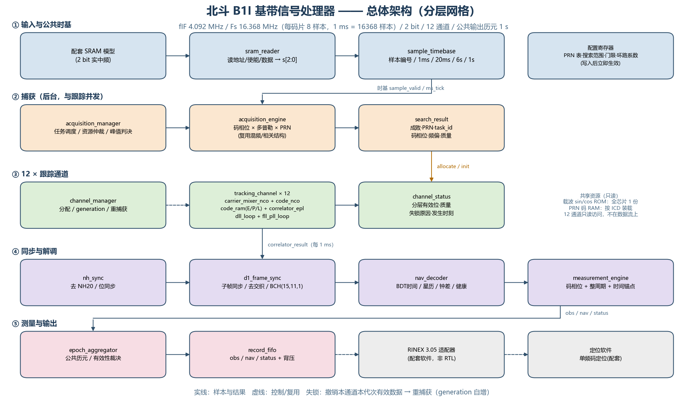

# 北斗 B1I 基带信号处理器总体架构方案

　　版本 v1.1　2026-09-27　课程：北斗B1I基带处理与电文解调 ASIC 设计实践（72 学时，2 人一组）

　　本文说明这颗基带处理器的输入输出、总体架构、模块划分、模块间信号和控制器状态机。参数取自实验指导书与 B1I ICD，凡指导书未给出的量，一律留待配套发布清单，不自行填数。

## 0　文档依据与参数基线

| 项 | 值 | 依据 |
|---|---|---|
| 中频 fIF | 4.092 MHz | 实验指导书 2.3 节，fIF = Fs/4 |
| 采样率 Fs | 16.368 MHz | 指导书 2.3 节：每码片 8 样本，Fs = 8 × 2.046 MHz |
| 1 ms 样本数 | 16368 | 2046 chip × 8 样本/chip |
| 量化 | 2 bit/样本，00=-3、01=-1、10=+1、11=+3 | 指导书 1.2 节 |
| 测距码 | 2.046 Mcps，2046 chip/ms，平衡 Gold 码截短 1 码片 | ICD 2.1 第 4.3 节 |
| 二次码 | NH20 = 00000100110101001110，1 ms/比特 | ICD 2.1 第 5.2.1 节 |
| 电文 | D1，50 bps；子帧 300 bit/6 s；主帧 1500 bit/30 s | ICD 2.1 第 5.2.2 节 |
| 纠错 | BCH(15,11,1)，g(X)=X⁴+X+1，两组交织成 30 bit | ICD 2.1 第 5.1.3 节 |
| 通道数 | 12 个逻辑通道，共用样本流和时基 | 课程安排 P5、P11 |
| 目标时钟 | （待定） | 指导书 12.1 节：从配套发布清单读取，缺失就报告缺失 |

**表 1　参数基线**

## 1　系统输入输出定义

### 1.1　输入

| 输入项 | 形式 | 字段 | 来源与约束 |
|---|---|---|---|
| SRAM 采样数据 | 同步 SRAM 读接口 | 读地址、读使能、读数据；内部取样有效 sample_valid | 字宽、地址单位、读延迟、样本总数由配套清单给出 |
| 场景配置 | 配置寄存器 | 候选 PRN 集合、噪声种子、每星 C/N0、动态类别 | 候选 PRN 集合可以作搜索输入，真实可见星清单只给评估 |
| 搜索配置 | 配置寄存器 | 多普勒起止与步长、码相位步长、相干与非相干时长、门限 | 门限形式与数值随任务书冻结 |
| 跟踪配置 | 配置寄存器 | DLL、FLL、PLL 系数，失锁超时，锁定门限 | 位宽与量纲见位宽与周期预算 |
| 输出配置 | 配置寄存器 | 历元间隔、记录使能、debug 使能 | 历元间隔默认 1 s |
| 时钟与复位 | 端口 | clk、rst_n | 目标频率从配套清单读取 |

**表 2　系统输入**

### 1.2　输出

| 输出项 | 内容 | 关键字段 | 有效性规则 |
|---|---|---|---|
| obs 观测记录 | 每个公共历元、每颗卫星一条 | 公共历元、PRN、channel_id、generation、整数码周期、分数码相位、多普勒、载噪比、measurement_valid、可用时刻 | 未锁定或没有时间锚点时 measurement_valid=0，字段置无效。不拿真值或 0 顶替 |
| nav 导航记录 | 解调出的 D1 电文参数 | PRN、bit_start_sample、subframe_id、BDT 时间、星历、钟差、健康、decode_valid、BCH 状态 | 校验失败或未同步时 decode_valid=0 |
| status 状态事件 | 通道状态迁移与异常 | channel_id、generation、状态前后值、失锁原因、发生时刻、overflow 与 timeout 标志 | 事件必须能被观察到，不允许静默恢复 |

**表 3　系统输出**

### 1.3　边界与真值隔离

　　指导书 12.1 节把评估真值和算法输入分开：完整 PRN 候选集合可以给捕获搜索，实际可见星清单、真实码相位、频偏和传播时延只能给评估程序。接口文档里要标明哪些字段属于评估专用。

　　RTL 只输出结构化记录，不拼 RINEX 文本。OBS 和 NAV 由配套适配器生成。

## 2　架构设计

### 2.1　总体数据流



**图 1　北斗 B1I 基带处理器总体架构**

　　样本从 SRAM 读出后进入解包和公共时基。时基同时喂给后台捕获引擎和 12 个跟踪通道。跟踪通道每毫秒交出一组 E/P/L 复相关值，一半送给环路和位同步，一路交给测量生成。同步解调部分完成 NH 去二次码、子帧同步、去交织和 BCH 译码，恢复出星历、钟差和健康字段。测量生成把整数码周期、分数码相位和电文时间锚点拼到一起，历元聚合再按公共历元把多星记录排好，最后经 FIFO 输出给配套适配器。

### 2.2　分层与职责

| 层 | 职责 | 不做什么 |
|---|---|---|
| 取数与时基层 | SRAM 读时序、2 bit 解包、样本编号、1 ms 与 20 ms 等边界 | 不做相关，不做控制决策 |
| 捕获层 | 搜索任务调度、码相位与多普勒假设、检测判决、向通道移交初值 | 不做持续跟踪 |
| 跟踪层 | 载波与码 NCO、混频、E/P/L 相关、DLL 与 FLL/PLL、锁定与失锁判断 | 不做电文解析 |
| 同步与解调层 | NH 去二次码、位同步、子帧同步、去交织、BCH、字段提取 | 不做测量聚合 |
| 测量与输出层 | 整周期加分数码相位、时间锚点、历元聚合、有效性裁决、记录输出 | 不做浮点定位，不拼文本 |
| 控制与配置层 | 顶层状态机、通道分配、重捕获、配置寄存器、错误上报 | 不进入数据通路 |

**表 4　分层与职责**

### 2.3　关键架构决策

| # | 决策 | 理由 |
|---|---|---|
| D1 | 输入按配套 SRAM 同步读接口设计，不按文件字节流 | 指导书 1.3 节给出字宽、读延迟和样本总数都由配套清单决定，接口必须照清单做 |
| D2 | 12 通道全并行，每通道独立 NCO、相关和环路状态 | 1 样本/时钟时通道占空比约 16%，复用省下的乘法器会被多端口累加器吃掉；全并行也便于逐通道定位故障 |
| D3 | 捕获与跟踪复用同一套混频、NCO 和相关结构 | 指导书 2.8 和 4.6 节要求核算后台捕获与 12 通道并发时的读写冲突和存储带宽 |
| D4 | 载波 sin/cos 表全芯片一份共享只读 ROM | 每通道一份要 12 份 ROM，共享后 ROM 面积降到约 1/12 |
| D5 | 相关、状态和测量记录都带 generation 字段 | 失锁重捕获后旧代次数据不能被误用（指导书表 2-2） |
| D6 | 模块间用 ready/valid 握手，未接纳的数据和标签保持稳定 | 指导书 2.8 节的要求；跨时钟域多位信息要保证字一致性 |
| D7 | 环路在 1 ms 窗口边界更新，并用旁路让新窗口第一个样本就用新系数 | 窗口内 16368 个样本共用一组系数，便于和定点模型逐位对齐 |

**表 5　关键架构决策**

### 2.4　资源与周期预算摘要

| 项 | 值 | 说明 |
|---|---|---|
| 每样本关键运算 | 12 通道共约 132 次定点运算/样本 | 混频 2 次，累加 6 次，码抽头 3 次 |
| 基准乘法器 | 24 个，每通道 2 个混频乘 | 393 MMAC/s；复用方案见位宽与周期预算第 8 节 |
| 1 ms 相干累加位宽 | 26 bit，E/P/L 各 I/Q 共 6 路 | 最坏情况 16368×3×512 = 25141248 |
| 20 ms 合并位宽 | 需要 30 bit，实配 32 bit | 最坏情况 502824960 |
| NCO 相位位宽 | 32 bit | IF 与码率都能精确表示，没有截断误差 |
| 时基回绕 | SAMPLE_INDEX 32 bit，262.4 s | 覆盖一个 30 s 主帧还绰绰有余 |

**表 6　资源与周期预算摘要**

## 3　模块划分

| 模块 | 职责 | 所属接口组 | 需求 |
|---|---|---|---|
| sram_reader | SRAM 读时序与样本解包 | SRAM 采样 | REQ-IN-000 |
| sample_timebase | 样本编号与 1 ms、20 ms、6 s、1 s 边界 | SRAM 采样 | REQ-TB-001..004 |
| carrier_lut | 载波 sin/cos 只读表，全芯片共享 | — | REQ-TRK-002 |
| carrier_mixer_nco | 载波 NCO 与 I/Q 混频 | correlator_result 前级 | REQ-TRK-002 |
| code_nco | 码相位 NCO（Q11.21）与码周期回绕 | — | REQ-TRK-002 |
| code_ram | PRN 码存储与 E/P/L 三抽头 | — | REQ-SIG-006 |
| correlator_epl | E/P/L 六路 1 ms 相干累加与窗口转存 | correlator_result | REQ-TRK-002 |
| dll_loop | 码环鉴别与二阶滤波 | correlator_result 到环路 | REQ-TRK-003 |
| fll_pll_loop | Costas 鉴相、二阶 PLL、FLL 辅助、锁定判决 | correlator_result 到环路 | REQ-TRK-003/004 |
| tracking_channel | 单通道集成，参数化复制为 12 路 | channel_status | REQ-TRK-001/005 |
| acquisition_engine | 码相位与多普勒假设的串行搜索与判决 | search_req、search_result | REQ-ACQ-001..006 |
| acquisition_manager | 搜索任务调度、资源仲裁、峰值判决与移交 | search_req、allocate | REQ-ACQ-004 |
| channel_manager | PRN 到通道的分配、状态机、重捕获、代次管理 | allocate、init、recover、cancel | REQ-TRK-001/004 |
| nh_sync | 去 NH20、位同步、位起点时标 | correlator_result 到同步 | REQ-SYN-001/002 |
| d1_frame_sync | 子帧同步、去交织、BCH | — | REQ-SYN-003/004 |
| nav_decoder | 时间、星历、钟差、健康字段提取 | obs、nav | REQ-NAV-001..003 |
| measurement_engine | 码相位、整周期、时间锚点合成伪距输入 | obs、nav | REQ-MEAS-001/002 |
| epoch_aggregator | 公共历元聚合与有效性裁决 | obs、nav | REQ-MEAS-003/004 |
| record_fifo | 结构化记录输出与背压 | obs、nav | REQ-OUT-001..003 |
| b1i_rx_top | 顶层互联、配置寄存器、错误上报 | 全部 | REQ-IMPL-002 |

**表 7　模块划分**

## 4　各模块关键信号

### 4.1　模块间接口组（按指导书表 2-2）

| 接口组 | 方向 | 关键字段 | 传输行为 |
|---|---|---|---|
| SRAM 采样 | 存储到输入处理 | 读地址、读使能、读数据；内部 sample_valid | 固定读延迟，取样有效只在数据有效时置位 |
| search_req | 管理到捕获 | PRN、task_id、搜索范围、积分配置、窗口参考 | ready/valid，未接纳时保持稳定 |
| search_result | 捕获到管理 | 成败、PRN、task_id、码相位、频偏、参考时刻、质量 | 单拍结果，带 task_id 便于匹配 |
| allocate 与 init | 管理及控制到通道 | channel_id、generation、PRN、初值、生效时刻 | 同拍生效，未接纳要重发 |
| correlator_result | 相关器到环路与同步 | E/P/L 复相关 I/Q、窗口完成、本地参考约定、PRN、generation | 每 1 ms 一次窗口完成脉冲 |
| channel_status | 通道到控制与管理 | 分层有效位、质量、失锁原因、发生时刻 | 事件式，脉冲突发 |
| recover 与 cancel | 控制与管理之间 | 任务身份、最后估计、重试次数、取消原因 | 握手确认 |
| obs 与 nav | 通道到输出 | 公共历元、测量或参数、有效位、身份、可用时刻 | FIFO 加 ready/valid，溢出可观察 |

**表 8　模块间接口组**

### 4.2　顶层关键端口

| 端口 | 方向 | 位宽 | 说明 |
|---|---|---|---|
| clk、rst_n | in | 1 | 统一时钟，异步复位同步释放 |
| sram_addr、sram_en、sram_rdata | out/in | 按配套清单 | SRAM 读接口 |
| sample_valid、sample | 内部 | 1、3 signed | 解包后的取样有效与幅度 |
| cfg_valid、cfg_addr、cfg_wdata、cfg_ready | in/out | 1、32、32、1 | 配置写入与读回 |
| rec_valid、rec_ready、rec_data、rec_last | out/in | 1、1、256、1 | 结构化记录输出 |
| ch_locked、ch_bit_valid、ch_nav_valid | out | 各 12 位 | 通道分层有效位 |
| error_valid、error_code | out | 1、32 | 错误上报，不静默 |

**表 9　顶层关键端口**

### 4.3　跟踪通道内部关键信号

| 信号 | 位宽 | 含义 |
|---|---|---|
| freq_word | 32 signed | 载波频率字 = IF 字 + 多普勒，直接驱动载波 NCO |
| carrier_phase | 32 | 载波相位累加器，模 2³² 回绕 |
| mix_i、mix_q | 13 signed | 样本乘 cos 与负样本乘 sin，全精度不截位 |
| code_phase | 32 | Q(11.21)，整数码片 [31:21] 加小数码片 [20:0] |
| code_inc | 32 signed | 码率增量，标称 262144 = 2²¹/8 |
| chip_idx | 11 | 当前码片索引，0 到 2045 |
| e_tap、p_tap、l_tap | 1 | E/P/L 三抽头码值 |
| i_e、q_e、i_p、q_p、i_l、q_l | 26 signed | 1 ms 相干累加结果，窗口完成时转存 |
| dump_valid | 1 | 窗口完成脉冲，与新窗口第一个样本同拍 |
| dll_disc、pll_disc | 16 signed | 压位后的码环与载波环鉴别器，用于观测 |
| locked | 1 | 幅值过门限并维持足够计数后置位 |

**表 10　跟踪通道内部关键信号**

## 5　控制器状态机

### 5.1　顶层控制状态机

```text
RESET -> IDLE -> CONFIG -> RUN_SINGLE -> RUN_MULTI -> DONE
                              |            |
                              v            v
                           ERROR <----- ABORT
```

| 当前状态 | 条件 | 次态 | 动作 |
|---|---|---|---|
| RESET | rst_n 释放且配置校验通过 | IDLE | 清所有 valid，读回配置 |
| IDLE | 收到启动且通道分配有效 | CONFIG | 下发 allocate 与 init，装载 PRN 码表 |
| CONFIG | 12 通道 init 完成 | RUN_SINGLE | 启动公共时基，放开样本取样 |
| RUN_SINGLE | 首个公共历元完成 | RUN_MULTI | 打开后台捕获与多星聚合 |
| RUN_MULTI | 样本耗尽或主机停止 | DONE | 冲刷 FIFO，输出末历元 |
| 任意 | FIFO 溢出、配置越界、格式错误 | ERROR | 置 error_code，撤销所有有效测量 |
| ERROR | 复位 | RESET | 错误码保持可读 |

**表 11　顶层控制状态机**

### 5.2　跟踪通道状态机

```text
RESET -> IDLE -> ACQUIRE -> TRACK_PULL_IN -> TRACK_LOCKED
                        ^                |              |
                        |                v              v
                    REACQUIRE <-------- LOST <---- BIT_SYNC
                                                       |
                                                       v
                                          FRAME_SYNC -> NAV_VALID
```

| 状态 | 进入条件 | 退出条件 | 输出有效位 |
|---|---|---|---|
| IDLE | 复位或取消 | 收到 allocate 与 init | 全部为 0 |
| ACQUIRE | 已分配 PRN 与搜索范围 | 捕获成功且质量达标，或超时 | 成功时 acquired=1 |
| TRACK_PULL_IN | 收到初值 | 锁定计数达标，或超时 | locked=0 |
| TRACK_LOCKED | 锁定计数达标 | 幅值或频率超限 | locked=1 |
| BIT_SYNC | 累加 NH20 相关 | 位边界置信度达标，或超时 | bit_valid=1 |
| FRAME_SYNC | 位流连续 | 子帧头匹配 | frame_valid=1 |
| NAV_VALID | 子帧译码且 BCH 通过 | 失锁，或校验连续失败 | nav_valid=1 |
| LOST | 锁定计数归零或超时 | 重捕获计时到 | 有效位清零，撤销本代次测量 |
| REACQUIRE | 重捕获计时到 | 重新分配 | generation 自增，旧代次数据作废 |

**表 12　跟踪通道状态机**

### 5.3　捕获引擎状态机

```text
IDLE -> LOAD_HYP -> INTEGRATE(1 ms) -> EVALUATE -> (还有假设? LOAD_HYP : DONE)
                                                              |
                                                              v
                                                        REPORT(峰值/门限)
```

| 状态 | 动作 | 时序 |
|---|---|---|
| IDLE | 等待 search_req | — |
| LOAD_HYP | 装载码相位初值与载波初相，清累加器 | 1 拍 |
| INTEGRATE | 累加 16368 个样本 | 16368 个 sample_valid |
| EVALUATE | 算 I²+Q² 或 |I|+|Q|/2，与当前峰值和门限比较 | 1 拍 |
| SWEEP | 推进到下一个假设，码相位步进满了就进多普勒位 | 1 拍 |
| REPORT | 输出 search_result，含成败、码相位、频偏、质量 | 握手 1 拍 |

**表 13　捕获引擎状态机**

### 5.4　相关器窗口时序

| 时刻 | 事件 | 说明 |
|---|---|---|
| 窗口第 1 到第 16367 个样本 | 累加 | 使用本窗口固定的一组系数 |
| 窗口最后 1 个样本 | ms_tick | 连同本样本一起转存 dump，累加器清零 |
| 下一拍，新窗口第 1 个样本 | dump_valid | 环路完成更新并旁路生效，新窗口立即用新系数 |
| 每 20 个 ms_tick | bit_boundary | 一个 D1 数据位边界 |
| 每 300 个数据位 | subframe_boundary | 子帧边界，6 s |
| 每 1000 ms | epoch_boundary | 公共输出历元 |

**表 14　相关器窗口时序**

### 5.5　复位与异常

　　复位采用异步复位、同步释放。复位后所有 valid 为 0，0 不当合法测量使用。

　　失锁、超时、校验失败都要置错误码并撤销当前有效测量，不能输出看着有效的假数据。

　　计数器回绕是定义好的行为，不产生负时间，也不重复历元。

　　ready/valid 未接纳时数据与标签保持稳定，FIFO 溢出必须能被观察到。

## 6　接口规范模板

　　以 correlator_result 为例，按指导书 12.2 节逐项写清。

| 项 | 内容 |
|---|---|
| 模块名称 | correlator_epl |
| 输入 | mix_i 与 mix_q（13 bit signed）、e/p/l_tap（1 bit）、sample_valid、ms_tick |
| 输出 | dump_i_e、dump_q_e、dump_i_p、dump_q_p、dump_i_l、dump_q_l（26 bit signed），dump_valid |
| 数值含义 | 有符号补码，1 ms 相干累加，最坏绝对值 16368×3×512 = 25141248，26 bit 刚好覆盖 |
| 更新条件 | sample_valid 有效时累加，ms_tick 时转存并清零 |
| 复位值 | 累加器全 0，dump_valid 为 0 |
| 异常行为 | 位宽按最坏情况推导，累加器不会上溢或下溢；输入越界由上游错误码捕获 |

**表 15　接口规范模板**

## 7　验证与验收对应

| 架构要素 | 验证方式 | 证据 |
|---|---|---|
| SRAM 取数与解包 | 定向向量加波形 | tb/unit/tb_sample_unpacker.sv |
| 公共时基边界 | 1 ms、20 ms、6 s、1 s 计数断言 | tb/unit/tb_sample_timebase.sv |
| 载波表 | 四象限定点值比对 | tb/unit/tb_carrier_lut.sv |
| 单通道跟踪链路 | 与定点参考模型逐 1 ms 比对 | tb/system/tb_tracking_channel.sv |
| 捕获搜索 | 与 FFT 圆相关参考比对码相位和频偏 | sw/b1i_ref/acquisition.py |
| 12 通道无丢样 | 吞吐计数与 SRAM 读带宽证据 | 待实现 |
| OBS 与 NAV 有效性 | RINEX 往返读取，缺测不伪造 | 待实现 |

**表 16　验证与验收对应**

## 8　待确认与风险

| # | 事项 | 状态 | 影响 |
|---|---|---|---|
| R1 | 配套环境发布清单：SRAM 字宽、读延迟、样本数，目标时钟，工艺库，时序角 | 未提供，按指导书 12.1 节报告缺失，不猜数 | 阻塞综合与后端 |
| R2 | G2 抽头表 PRN 38 到 63，以及移位方向复核 | 已转录 37 组，自相关次峰 134 偏大 | 影响 PRN 码正确性 |
| R3 | 跟踪通道 code_phase 观测异常（ISSUE-001） | 已复现并定位方向 | 阻塞 L2 回归转绿 |
| R4 | 捕获引擎 RTL 未实现 | 参考模型已验证，码相位 123.000 chip 命中 | 本阶段后续任务 |
| R5 | 环路系数与门限未冻结 | 当前是一组自洽默认值 | 影响灵敏度与动态指标 |

**表 17　待确认与风险**

